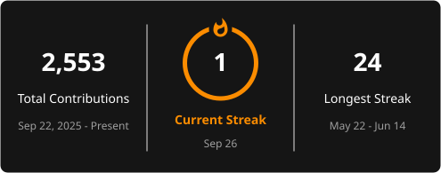

## Hey, I'm Jash

Year 10 student. Interested in medicine, technology, and what happens when you
combine both. I build real products rather than tutorials, and I run the
accounting and operations side of a multi-entity portfolio while I do it.

### Currently building

- **Callau**: AI receptionist for Australian small and medium businesses.
- **HAVEN**: game jam platform for Hack Club Satellite, Sydney 2026.
- **Limelight GENESIS**: filmathon platform for Limelight Creatives.
- **ImmigratePro**: immigration case management, web app and React Native mobile.
- **PolymathOS**: personal systems and decision-making infrastructure.

Most of these live in private repos, so the contribution graph below tells a
truer story than the public repo list does.

### Interests

Medicine and neuroscience. AI, software engineering and cybersecurity.
Entrepreneurship and business strategy. Influence, negotiation and psychology.
Systems design and long-term thinking.

### Working with

### Focus right now

Academic foundation and UCAT preparation. Building technical depth alongside
strategic thinking. Creating work that compounds over time.

> Build the foundation right. Stack leverage early. Think in decades.

### Elsewhere

---

<!--
  Stats are served from a self-hosted github-readme-stats instance
  (Maverick-500/github-readme-stats on Vercel) using a private PAT, so private
  contributions are counted. The cb= parameter is rotated daily by
  .github/workflows/refresh-profile.yml to defeat GitHub's camo image cache.
-->

